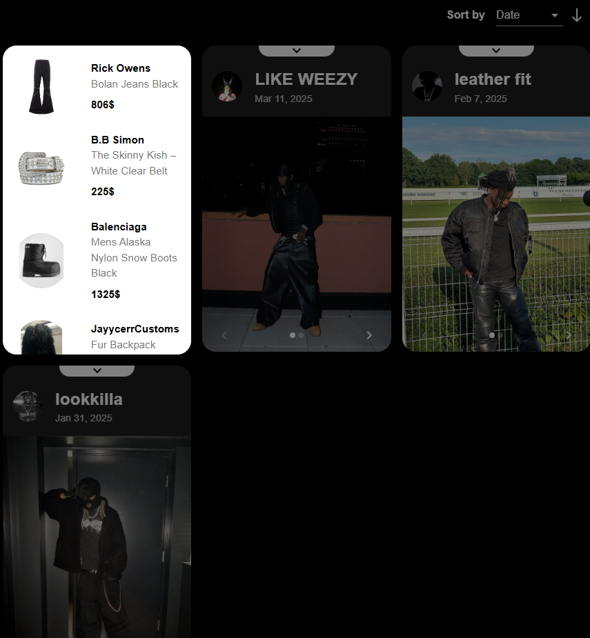
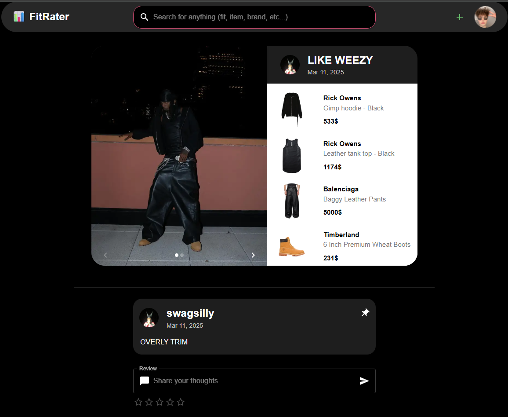
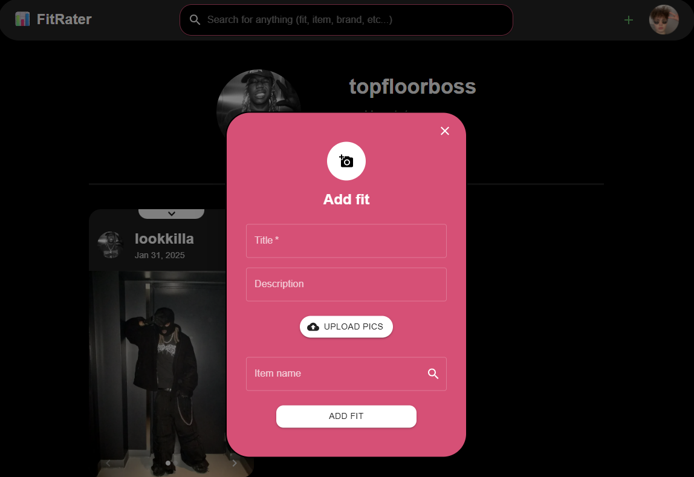
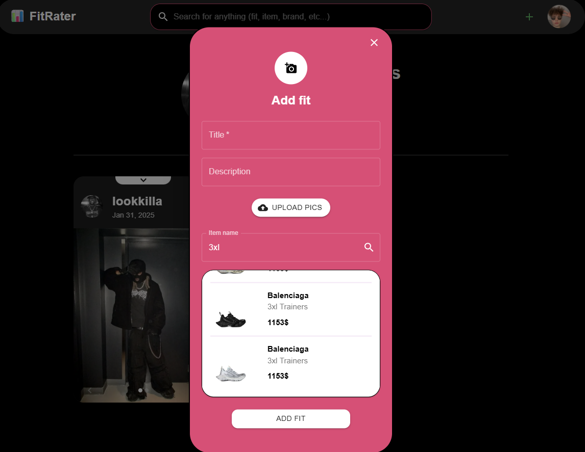
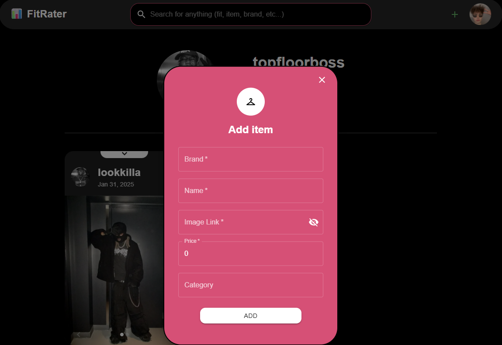
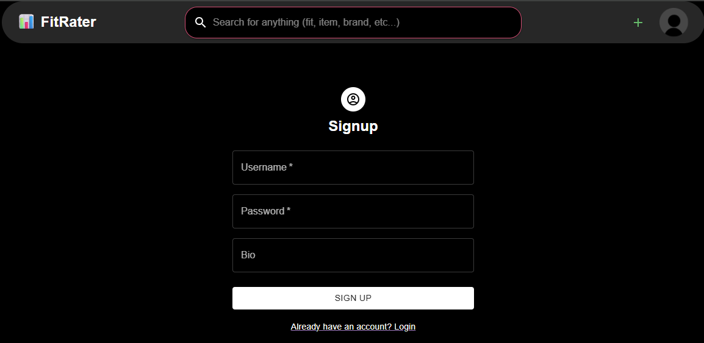
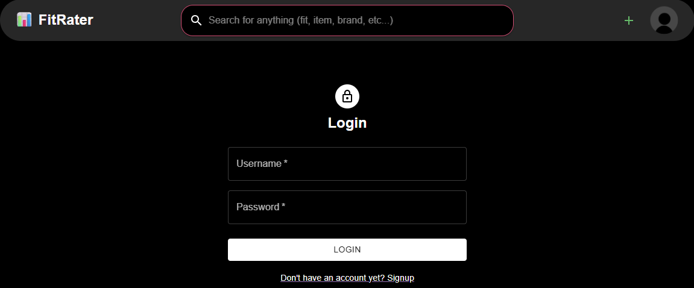

# Coursework Report

## Introduction

### Purpose and Objectives of the Application

The objective of the "FitRater" application is to allow users to share and receive feedback on their outfits through a user-friendly platform. The application enables social interaction by letting users post outfit images and attach items, rate others, and view profiles, contributing to a fashion-focused community.

### Brief Overview of the Chosen Project

"FitRater" is a full-stack web application built using **FastAPI** for the backend and **React + MUI** for the frontend. It utilizes a **MongoDB** database for storing users, outfits, and ratings. The app supports image uploading, user authentication, and profile customization.

## Problem Definition and Requirements

### Description of the Problem the Application Solves

There are limited platforms dedicated specifically to sharing and reviewing fashion outfits. "FitRater" fills this gap by providing a niche community where users can receive feedback, track engagement, and express their style.

### Functional Requirements

- User authentication (sign-up, login, logout)
- Upload and view outfit photos
- Rate and review other users' outfits
- Profile management
- View total ratings

### Non-Functional Requirements

- User data security (secure tokens and storage)
- Responsive user interface
- Fast image upload and retrieval
- Scalable backend with RESTful API
- Clean and maintainable codebase using OOP

## Design and Implementation

### Design Patterns Used

- **Decorator**: Implemented decorator in `AbstractModel` to validate data before passing it to router endpoint.
- **Singleton**: Used for singular `Database` class entity to allow operations with MongoDB from any endpoint of the project.

### Object-Oriented Principles Used

The application strongly adheres to all **four pillars of OOP**:

- **Abstraction**: Implemented `AbstractModel` to make a blueprint for all basic project models.
- **Encapsulation**: Database access is encapsulated within the `Database` class in `config/database.py`.
- **Inheritance**: Pydantic model inheritance is used for shared attributes between data classes.
- **Polymorphism**: Functions like `getUser()` behave differently based on inputs (`@username` vs. token), showcasing dynamic behavior.

### Class Diagrams and Structure

- `Pydantic` models for convenient request params validation:

### `UserAuthModel`

| Attribute | Type   | Required | Description                      |
|-----------|--------|----------|----------------------------------|
| `username` | `str` | ✅       | Username for authentication.     |
| `password` | `str` | ✅       | Password for authentication.     |

---

### `UserCredentialsModel`

| Attribute     | Type   | Required | Description                         |
|---------------|--------|----------|-------------------------------------|
| `userToken`   | `str`  | ✅       | Unique token identifying the user.  |
| `secretToken` | `str`  | ✅       | Secret token for secure access.     |

---

### `UserModel`

| Attribute         | Type                             | Required | Description                            |
|-------------------|----------------------------------|----------|----------------------------------------|
| `userCredentials` | `Optional[UserCredentialsModel]` | ❌       | Credentials for the user (if available). |
| `username`        | `str`                            | ✅       | User's display name or login username.  |
| `password`        | `str`                            | ✅       | User's password.                        |
| `bio`             | `Optional[str]`                  | ❌       | Short biography or user description.    |

---

### `FitModel`

| Attribute        | Type                         | Required | Description                                                      |
|------------------|------------------------------|----------|------------------------------------------------------------------|
| `userCredentials` | `UserCredentialsModel`       | ✅       | Credentials of the user who submitted the fit.                   |
| `fitID`          | `Optional[str]`              | ❌       | Unique identifier for the fit (outfit).                          |
| `title`          | `str`                        | ✅       | Title or name of the outfit.                                     |
| `date`           | `str`                        | ✅       | Date when the outfit was created or submitted.                   |
| `description`    | `Optional[str]`              | ❌       | Additional context or information about the outfit.              |
| `itemsID`        | `Optional[List[str]]`        | ❌       | List of item IDs included in the outfit.                         |
| `totalPrice`     | `int`                        | ✅       | Combined price of all items in the outfit.                       |
| `totalReviews`   | `int`                        | ✅       | Total number of reviews received for this outfit.                |
| `avgGrade`       | `float`                      | ✅       | Average rating score given by other users.                       |

---

### `ItemModel`

| Attribute   | Type              | Required | Description                                      |
|-------------|-------------------|----------|--------------------------------------------------|
| `itemID`    | `Optional[str]`   | ❌       | Unique identifier for the item.                 |
| `brand`     | `str`             | ✅       | Brand name of the clothing item.                |
| `name`      | `str`             | ✅       | Name or title of the item.                      |
| `img`       | `str`             | ✅       | Image URL or path representing the item.        |
| `price`     | `int`             | ✅       | Price of the item.                              |
| `category`  | `Optional[str]`   | ❌       | Optional category (e.g., shoes, jacket).        |

---

### `ReviewModel`

| Attribute        | Type                         | Required | Description                                                    |
|------------------|------------------------------|----------|----------------------------------------------------------------|
| `userCredentials` | `UserCredentialsModel`       | ✅       | Credentials of the user who wrote the review.                  |
| `reviewID`       | `Optional[str]`              | ❌       | Unique identifier for the review.                              |
| `fitID`          | `str`                        | ✅       | ID of the outfit (fit) that the review is associated with.     |
| `grade`          | `int`                        | ✅       | Rating score given in the review.                              |
| `date`           | `str`                        | ✅       | Date when the review was submitted.                            |
| `comment`        | `Optional[str]`              | ❌       | Optional textual feedback or comment.                          |

- `Database` class for handling database operations:

This class provides a static interface to interact with the MongoDB database for the Rate My Fit application. It includes methods to connect to the database, update item collections, and create search indices.

#### Attributes

| Attribute | Type       | Description                          |
|-----------|------------|--------------------------------------|
| `__URI`   | `str`      | Private class variable holding the MongoDB URI. |
| `Client`  | `MongoClient` | MongoDB client instance.          |
| `DB`      | `Database` | Reference to the `RateMyFit` database. |
| `Users`   | `Collection` | MongoDB collection for users.       |
| `Fits`    | `Collection` | MongoDB collection for outfits.     |
| `Reviews` | `Collection` | MongoDB collection for reviews.     |
| `Items`   | `Collection` | MongoDB collection for items.       |

#### Methods

---

#### `connect() -> None`

Initializes a connection to the MongoDB instance using credentials stored in environment variables.

- Loads environment variables from `.env`.
- Sets up connections to the `Users`, `Fits`, `Reviews`, and `Items` collections.

---

#### `updateItems(replace: bool = False) -> None`

Updates the `Items` collection in the database by loading item data from a JSON file.

- **Parameters:**
  - `replace`: If `True`, the existing items collection is cleared before inserting new data.

---

#### `createIndices(indexModel: SearchIndexModel, collections: list[str]) -> None`

Creates search indices on specified collections using the provided index model.

- **Parameters:**
  - `indexModel`: The `SearchIndexModel` to apply.
  - `collections`: List of collection names (as strings) to apply the index to.

### Key Algorithms and Data Structures Implemented

- UUID generation for secure tokens
- Image file handling with extension detection and validation
- Data parsers for extending items base
- Adaptive search by query

## Development Process

### Tools and Environment

- **Backend**: Python, FastAPI, Pydantic, MongoDB
- **Frontend**: React, TypeScript, MUI
- **Dev Tools**: VSCode, GitHub
- **Testing**: Pytest, FastAPI TestClient

### Steps Followed During Development

1. Requirement gathering and feature planning
2. Backend API development and testing
3. Frontend UI/UX design with MUI components
4. Integration and authentication
5. Testing, debugging, and documentation

## Results and Demonstration

### Application Features

- Sign up and login/logout
- Add outfit entries with images and attached items
- Rate other users’ outfits
- View personal and public profiles
- Responsive design for mobile/desktop

### Screenshots or Visuals

---

## Testing and Validation

### Description of Testing Procedures

- Unit tests written using **pytest**
- Route handlers tested with **FastAPI’s TestClient**

### Test Results and Issues Resolved

- ✅ All user endpoint routes return correct responses (200/403/404)
- ✅ Invalid tokens/users are handled securely
- ✅ Edge cases for image uploads (missing file, wrong extension)

## Conclusion and Future Work

### Summary of Achievements

- Implemented a full CRUD API using FastAPI
- Integrated secure authentication and profile features
- Applied all OOP principles and design patterns
- Completed frontend in React with MUI and animations
- Built a testing suite using Pytest and FastAPI tooling

### Recommendations for Future Improvements

- Implement JWT authentication
- Improve image compression and CDN support
- Add ML-based item detection from image